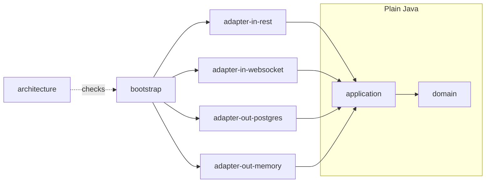
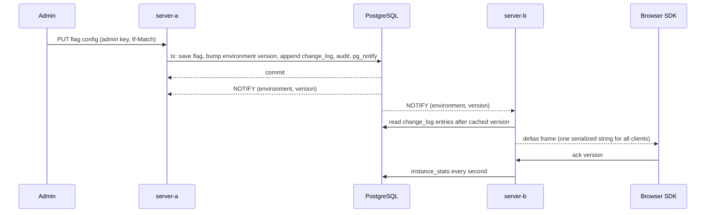

# flagtide: design notes

How the project is put together and in what order it was built. The decisions behind the non-obvious choices are in `docs/adr/`.

## Goal

A self-hosted feature flag service with two claims that can be checked:

1. A flag change committed on any server instance reaches every open browser well under a second. Target: p95 under 300 ms from commit to client acknowledgement with 5,000 connected clients on a laptop.
2. Java on the server and TypeScript in the browser evaluate a flag identically. One written spec, one shared set of at least 200 test vectors, both languages run in CI, any mismatch fails the build.

The back end is Quarkus in hexagonal architecture with DDD on a real domain (projects, environments, flags, targeting rules, segments, rollouts). The front end is an Nx monorepo with a framework-agnostic TypeScript engine, a signals-first Angular SDK, an Angular Material admin and a demo shop.

## Scope

### Must have

| Area | Item |
| --- | --- |
| Algorithm | Spec in `docs/evaluation-spec.md`, MurmurHash3 x86 32 bucketing, own implementations in Java and TypeScript, published reference vectors |
| Algorithm | Conformance suite, at least 200 vectors in `spec/vectors/*.json`, both languages in CI |
| Domain | Project, Environment, Flag (boolean, string, number, JSON) with variants, ordered rules, segments, rollouts, off variant, kill switch |
| Domain | Aggregate invariants, value objects, domain events, per-environment version, audit log, optimistic concurrency |
| Back end | Hexagonal modules enforced by ArchUnit, in-memory adapter, PostgreSQL adapter with Flyway |
| Back end | REST admin API with OpenAPI, admin and SDK keys per environment |
| Real time | WebSockets Next, hello with last version, deltas or snapshot, heartbeats |
| Real time | Two instances sharing changes through PostgreSQL LISTEN/NOTIFY, docker compose proof |
| SDK | libs/core engine and RxJS connection manager, reconnect with exponential backoff and full jitter |
| SDK | libs/angular: `provideFlagtide`, `injectFlag`, structural directive, `canMatch` guard factory, status signal, zoneless, SSR, offline start, dev overrides panel |
| Apps | apps/admin: list, search, edit with rule validation, environments, audit log, propagation monitor |
| Apps | apps/demo-shop next to the admin |
| Quality | Property tests, integration tests, SDK tests with fake server and marble tests, Cypress E2E, k6 load test, benchmarks |
| Project done | `docker compose up` starts PostgreSQL, two server instances, admin and demo shop |
| Project done | ng-packagr build and `npm pack` for libs/angular |

### Stretch

Flag prerequisites with cycle detection, scheduled changes, Oracle persistence adapter, SSE fallback. Prerequisites with cycle detection is the one I would build first, because it is pure domain work. The evaluation spec leaves room for it (a `prerequisites` list on the flag config, ignored by spec version 1). Everything else goes to "what I'd do next" in the README.

### Out of scope

SSO and user management beyond API keys, experiment analytics, billing, multi-tenancy, a bucketing attribute other than the context key, native image builds.

## Versions

| Tool or library | Pinned | Source and notes |
| --- | --- | --- |
| Node.js | 24.21.0 (LTS "Krypton") | Angular 22 requires `^22.22.3 || ^24.15.0 || >=26`. Docker images use `node:24-alpine` |
| pnpm | 12.8.1 | npm registry (`npm view pnpm`). Run with `pnpm@12.8.1` verified on Node 24.21 |
| Nx | 23.2.1 | npm and GitHub releases (23.3 is still beta). `@nx/angular`, `@nx/js`, `@nx/eslint`, `@nx/vitest` share the version |
| Angular (core, cli, build, ssr, platform-server) | 22.2.1 | npm `latest`, angular.dev (v22.2.1 docs) |
| Angular Material and CDK | 22.2.1 | npm |
| ng-packagr | 22.2.4 | npm. Peer: TypeScript `>=6.0 <6.1` |
| TypeScript | 6.0.3 | npm. Latest on npm is 7.0.2, but Angular 22, ng-packagr 22 and typescript-eslint 8.71 all cap at `<6.1`. See ADR 0003 |
| RxJS | 7.8.2 | npm `latest` (no stable 8) |
| zone.js | not used | angular.dev/guide/zoneless: zoneless is the default since v21, remove zone.js |
| Vitest | 5.0.3 (+ `@vitest/coverage-v8` 5.0.3), Vite 8.3.2 | npm. Angular's `@angular/build:unit-test` accepts `^4.0.8 \|\| ^5.0.0`. See ADR 0004 |
| ESLint | 10.12.0 with typescript-eslint 8.71.0 and angular-eslint 22.5.0 | npm peer ranges checked |
| Prettier | 3.9.9 | npm |
| Cypress | 16.1.1 | npm and GitHub releases. `@nx/cypress` 23.2.1 only allows `cypress < 16`, so Cypress runs through a plain config and a run-commands target. See ADR 0003 |
| Playwright | 1.63.0 | npm. Screenshots and the demo recording, not the E2E runner |
| tinybench | 6.2.0 | npm. SDK evaluation benchmark |
| fast-check | 4.10.2 | npm. Differential tests of the TS semver against `semver` |
| semver (npm) | 7.8.5 | dev dependency, differential test only. The shipped code uses its own parser |
| ws | 8.22.0 | dev dependency, fake WebSocket server in SDK tests |
| openapi-typescript | 7.13.0 | npm. Generates admin API types from the committed OpenAPI file |
| Lighthouse | 13.5.0 | npm. Run as a tool with `CHROME_PATH=/usr/bin/google-chrome`, not a dependency |
| license-checker-rseidelsohn | 5.0.1 | npm. Production license report |
| Java | 21 (Temurin 21.0.12.1) | Adoptium API. The machine only had a JRE, so a JDK was installed in user space (see section 5) |
| Maven | 3.9.16 via Maven Wrapper | Docker Hub tag `maven:3.9.16-eclipse-temurin-21`; Quarkus 3.40 guide lists Maven 3.9.16 |
| Quarkus | 3.40.1 (platform BOM `io.quarkus.platform:quarkus-bom:3.40.1`) | quarkus.io blog and GitHub release of 2026-09-30: 3.40 is the new LTS. 4.0.0.Beta1 (2026-10-01) is a beta and is not used. Extension metadata for websockets-next, reactive-pg-client, flyway, smallrye-openapi: `status: stable` |
| Vert.x | 4.5.34 (managed by the Quarkus BOM) | Latest `vertx-pg-client` on Central is 5.2.0 but Quarkus 3.40 is built on Vert.x 4.5. Never override the BOM |
| Flyway | 12.0.0 (managed by the BOM) | Central has 13.9.0, the BOM decides |
| PostgreSQL JDBC | 42.7.13 (BOM) | Maven Central |
| SmallRye OpenAPI | 4.3.5 (BOM) | Maven Central. 4.4 is alpha |
| JUnit | 6.1.3 (BOM) | Maven Central. jqwik 1.10.1 and ArchUnit 1.5.1 run on it |
| jqwik | 1.10.1 | Maven Central and jqwik.net release notes. Release notes say it is probably the last on JUnit Platform 1.x. EPL-2.0, test scope only |
| AssertJ | 3.27.7 | Maven Central. 4.0.0-M1 is a milestone, not used |
| ArchUnit | 1.5.1, core artifact `archunit` | Maven Central. Plain `@Test` methods calling `rule.check(classes)`, no JUnit engine needed |
| Testcontainers | 2.0.5 (BOM), artifact `testcontainers-postgresql` | PostgreSQL 18.6 starts under Docker 29.1.3 |
| REST Assured | 6.0.1 (BOM) | Maven Central |
| Awaitility | 4.3.0 (BOM) | Maven Central |
| JaCoCo | 0.8.15 (BOM) | Maven Central |
| JDBI | 3.55.0 (`jdbi3-core`, `jdbi3-postgres`, `jdbi3-jackson2`) | Maven Central, Apache-2.0 |
| Jackson | 2.21.7 (BOM) | Maven Central |
| Spotless plugin | 3.10.3 with google-java-format 1.37.0 | Maven Central |
| Checkstyle | 14.3.0 with maven-checkstyle-plugin 3.6.0 | Maven Central. `RequireThis` enforces the `this.` rule |
| maven-compiler-plugin | 3.15.0 | 4.0.0-beta-5 is not stable |
| maven-surefire, maven-failsafe | 3.6.0 | Maven Central (the Quarkus parent can raise this) |
| maven-enforcer-plugin | 3.6.3 | Maven Central |
| PostgreSQL (Docker) | `postgres:18.6` | Docker Hub |
| k6 (Docker) | `grafana/k6:2.3.0` | GitHub release 2026-09-21 and Docker Hub. `k6/websockets` is stable in 2.x |
| nginx (Docker) | `nginxinc/nginx-unprivileged:stable-alpine` | Docker Hub |
| JRE image | `eclipse-temurin:21-jre-noble` | Docker Hub |
| actionlint (Docker) | `rhysd/actionlint:1.7.12` | Docker Hub. Replaces `act`, which is not installed |
| GitHub Actions | checkout v7, setup-node v7, setup-java v6, cache v6, upload-artifact v7, pnpm/action-setup v6, nrwl/nx-set-shas v5 | GitHub releases |

## Architecture

### Repository layout

```
flagtide/
  apps/
    server/               Maven reactor, Nx project "server" (run-commands targets)
      domain/             plain Java, no framework imports
      application/        use cases, ports, port contract tests (test-jar)
      adapter-in-rest/    Quarkus REST, DTOs, exception mappers, auth filter
      adapter-in-websocket/  WebSockets Next endpoint
      adapter-out-postgres/  JDBI, Flyway migrations, pg_notify, PgSubscriber
      adapter-out-memory/    in-memory persistence and change feed
      bootstrap/          Quarkus application: wiring, config, packaging
      architecture/       ArchUnit rules over all modules (test only)
    admin/                Angular Material admin (Nx "admin")
    demo-shop/            Angular SSR shop (Nx "demo-shop")
    e2e/                  Cypress (Nx "e2e")
  libs/
    core/                 @flagtide/core: evaluator, protocol client, RxJS connection manager
    angular/              @flagtide/angular: publishable Angular SDK
  spec/                   vectors, JSON schema, oracle script (Nx "spec")
  bench/                  sdk-eval, k6 scripts, results, hardware report
  docs/                   adr/, evaluation-spec.md, protocol.md
  docker/                 Dockerfiles, nginx config, seed data
  scripts/                style guard, smoke scripts, pack check
  compose.yaml
  .github/workflows/ci.yml
```

Java base package `dev.flagtide`, Maven groupId `dev.flagtide`, artifact ids `flagtide-<module>`.

### Back end module map



Rules, enforced by Maven (a module only declares the dependencies in the diagram, the enforcer bans anything else in `domain` and `application`) and by ArchUnit in the `architecture` module:

- `domain` imports only the JDK. No Jackson, no Jakarta, no Quarkus, no Vert.x.
- `application` imports `domain` and the JDK only. Use cases are plain classes, wired by producers in `bootstrap`.
- Adapters depend on `application` and never on each other.
- Inbound adapters call use cases through the driving ports. Outbound adapters implement driven ports.
- Only `bootstrap` knows every module.

### Domain model

- Value objects: `ProjectKey`, `EnvironmentKey`, `FlagKey`, `SegmentKey`, `VariantKey` (slug `^[a-z0-9][a-z0-9_-]{0,63}$`, no dots), `Percentage` (integer 0 to 100000, one unit is 0.001 percent), `Weight` (same range), `Revision` (long), `EnvironmentVersion` (long, only grows), `SemanticVersion` (semver 2.0.0 with pre-release ordering), `ContextKey`.
- Aggregates: `Project` (with its `Environment` entities and their API keys), `Flag` (definition: key, type, variants, description, archived; per-environment `FlagEnvironmentConfig`: enabled, kill switch, off variant, ordered rules, fallthrough, salt), `Segment` (per environment).
- Invariants held by `Flag`: unique and contiguous rule order, rollout weights sum to exactly 100000, variant values match the flag type, off variant and every served variant exist, segment references exist (checked against the environment's segment keys passed into the command).
- Domain events: `FlagCreated`, `FlagDefinitionChanged`, `FlagConfigChanged`, `FlagToggled`, `KillSwitchEngaged`, `KillSwitchReleased`, `FlagArchived`, `SegmentSaved`, `SegmentDeleted`, `EnvironmentCreated`. Each has an id, `ZonedDateTime` timestamp and author.
- Errors: `sealed interface FlagtideError` (`NotFound`, `Conflict`, `ValidationFailed`, `Unauthorized`, `Forbidden`) carried by one `FlagtideException`, mapped to RFC 9457 problem responses by exception mappers in the REST adapter.
- Evaluation read model: `FlagConfig` (the client format of `docs/evaluation-spec.md`) produced by `FlagCompiler` from a `Flag` and an environment. The server's `Evaluator` and the TypeScript engine run on exactly this shape.
- Time: a `TimeSource` port returns `ZonedDateTime` in UTC. `Instant` and `java.time.Clock` are not used.

### Ports (application)

Driven: `FlagRepository` (load, save with expected revision), `SegmentRepository`, `ProjectRepository`, `ChangeLog` (append changes for an environment and return the new version, read entries since a version, oldest retained version), `AuditLog`, `ApiKeyStore`, `ChangeFeed` (subscribe to "environment E reached version V"), `PropagationStats`, `TransactionRunner`, `TimeSource`, `IdGenerator`.

Driving: one use case class per operation (create project, create environment, create flag, update flag definition, configure flag in an environment, toggle, engage and release kill switch, archive, save and delete segment, query flags, read audit log, authenticate key, build snapshot, deltas since version, record acknowledgement, read propagation stats).

Port contract tests live in `application` as abstract test classes in a test-jar. The in-memory adapter runs them first, the PostgreSQL adapter runs them again. That is what makes "the ports are real" a tested claim.

### Data model (PostgreSQL, Flyway)

`projects`, `environments` (`version bigint` per environment), `api_keys` (kind, environment, label, `secret_hash` for admin keys, plain `secret` for SDK keys because they ship to browsers anyway), `flags` (key, `revision`, `definition jsonb`, archived), `segments` (per environment), `change_log` (primary key `(environment_id, version)`, `committed_at timestamptz`, `changes jsonb` in client format), `audit_log` (author, entity, action, `before`/`after jsonb`, timestamp, environment version), `instance_stats` (instance id, updated at, payload). Aggregates are stored as JSONB documents next to a few indexed columns (ADR 0007).

### Real-time flow



The writer instance also listens, so every instance has exactly one code path for fan-out. The delta frame is serialized once and sent to all sockets of the environment. Each instance keeps a bounded in-memory ring of recent change log entries per environment and a cached serialized snapshot per `(environment, version)`, so a reconnect storm does not hit the database for every client.

### Wire protocol (summary, full text in `docs/protocol.md`)

JSON text frames with a `t` discriminator. Client to server: `hello {sdkKey, version?, clientId, sdk}`, `ack {v}`. Server to client: `snapshot {v, committedAtMs, flags, segments}`, `deltas {from, to, entries[{v, committedAtMs, changes[{op, kind, key, config?}]}]}`, `hb {ts}` every 15 s, `error {code, message}`. Custom close codes in the 4000 range: 4400 bad frame, 4401 unauthorized, 4408 no hello in time, 4429 slow consumer. A client within the retained window gets exactly the missed entries in order. A client older than the window, or ahead of the server, gets a snapshot. Connection status in the SDK: `connecting`, `live`, `offline`, `stale`, defined in ADR 0010.

### CI

One workflow, `.github/workflows/ci.yml`: `static` (formatting and text rules), `conformance` (both languages, blocks the rest), `web` (lint, type check, unit tests with coverage thresholds, production builds, `npm pack` check), `server` (`./mvnw verify` with Testcontainers and JaCoCo gates), `licenses`, `e2e` (compose stack, Cypress, Lighthouse, the must-have script) and `bench` (a short load test).

## Risks

| # | Risk | Mitigation |
| --- | --- | --- |
| 1 | Java and TypeScript diverge (signed 32-bit arithmetic, unsigned modulo, lone surrogates, double parsing, semver numeric identifiers beyond 2^53, array attributes, missing attributes with negation) | Spec first, hand-written edge vectors, hash and bucket expectations from an independent Python oracle, differential test of semver against the `semver` package, fuzz in both languages |
| 2 | Propagation p95 over 300 ms at 5,000 clients on a 15 GB laptop | Serialize once and reuse the string, ring buffer and snapshot cache, `-Xmx512m` per instance, a full 5,000 client run as soon as the stream worked, tuning before the UI existed. If the target is missed, publish the real numbers and the analysis |
| 3 | LISTEN/NOTIFY misses events (listener reconnect, 8,000 byte payload, no durability) | Pointer-only payload, resync from `change_log` after every reconnect, test that kills the listener backend with `pg_terminate_backend` |
| 4 | Quarkus multi-module wiring (Jandex indexing for CDI beans in library modules, producers for plain application classes, build-time adapter selection) | A spike before the REST code; `quarkus.index-dependency` or the Jandex plugin in each adapter module; `@IfBuildProperty` for adapter selection |
| 5 | Toolchain skew (TS 6.0 cap, Node 24.15 minimum, `@nx/cypress` below Cypress 16, Vitest 5 with the Angular unit-test builder, Nx 23 generators) | Versions pinned in section 4.1 with escape hatches in ADR 0003 and ADR 0004. If a generator output does not match, hand-edit the config rather than downgrade |
| 6 | Memory pressure (two JVMs, PostgreSQL, k6 and Angular builds on 15 GB shared) | Heap caps, one heavy build at a time, 50 VUs with 100 sockets in k6, compose resource limits |
| 7 | SSR and WebSocket in the same SDK: browser globals on the server, hydration mismatch when server and client render different flag values | No socket and no storage on the server platform, snapshot passed through `TransferState`, a test that renders with `renderApplication` in a Node environment |
| 8 | Background tabs throttle timers and trigger false `stale` | Heartbeat watchdog compares timestamps instead of counting timer ticks and re-checks on `visibilitychange` |
| 9 | Clock skew makes commit-to-ack numbers wrong outside one host | Measured on one host and stated as such. `committedAt` is taken by the writer, acks are timed by the receiving instance (ADR 0011) |
| 10 | Cypress cannot drive two origins at once | Preferred: a harness page with admin and shop in two iframes with `chromeWebSecurity: false`, the same layout as the demo GIF. Fallback: trigger through the admin API and assert in the shop |
| 11 | jqwik is EPL-2.0 and its last planned release uses JUnit Platform 1.x | Test scope only, verified on JUnit 6.1.3 in a spike; property tests stay thin wrappers over plain functions so they can move |

## Milestones

| Milestone | What it delivered |
| --- | --- |
| M1 Evaluation core | `docs/evaluation-spec.md`, 616 shared vectors, the TypeScript and Java engines, MurmurHash3 checked against published vectors, `pnpm conformance` |
| M2 Domain and application | Aggregates, value objects, domain events, use cases, ports with contract tests, the in-memory adapter |
| M3 Quarkus server | PostgreSQL adapter with Flyway and JDBI, REST admin API, OpenAPI, API keys, 409 on stale edits |
| M4 Real time | WebSockets Next stream, deltas and snapshot fallback, LISTEN/NOTIFY across two instances, propagation statistics |
| M5 SDK | `libs/core` engine and connection manager, `libs/angular` with signals, directive, guard, status and the overrides panel |
| M6 Admin app | Flag list and editor, rules and rollouts, segments, environments, audit log, propagation monitor |
| M7 Demo shop and end to end | Server rendered shop behind flags, Cypress suite with an admin and shop harness |
| M8 Hardening | Coverage gates, license policy, Lighthouse, must-have script, load test, CI workflow |

Every milestone ended with lint, type check, all tests and a production build green, then a commit.

## Architecture decision records

| ADR | Decision |
| --- | --- |
| 0001 | Nx 23 monorepo with pnpm 12 on Node 24 |
| 0002 | Maven inside Nx through run-commands targets |
| 0003 | Toolchain lines: Quarkus 3.40 LTS, Angular 22, TypeScript 6.0, Cypress without the Nx plugin |
| 0004 | Vitest instead of Jest |
| 0005 | Hexagonal architecture as Maven modules plus ArchUnit |
| 0006 | Aggregate boundaries, concurrency and the API key model |
| 0007 | Persistence with JDBC, JDBI, Flyway and JSONB documents |
| 0008 | Change log, per-environment versions and LISTEN/NOTIFY |
| 0009 | Evaluation algorithm, bucketing and the conformance suite |
| 0010 | Wire protocol, authentication and connection status |
| 0011 | How propagation time is measured |
| 0012 | SDK packaging, zoneless and SSR |
| 0013 | Dependency license policy |
| 0014 | Layer coverage gates across modules |
| 0015 | REST conventions |
| 0016 | Quarkus multi-module wiring |
| 0017 | Stream fan-out and the load test |
| 0018 | Admin editor state model |
| 0019 | End-to-end harness and demo shop wiring |
| 0020 | The project name |
| 0021 | What is not built, and why |
| 0022 | Where the README numbers and the demo GIF come from |
