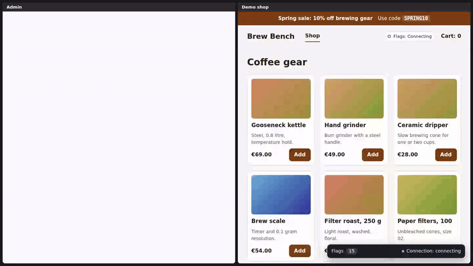
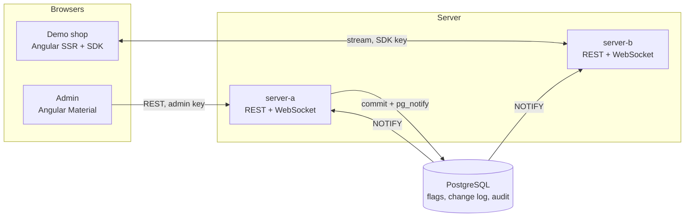
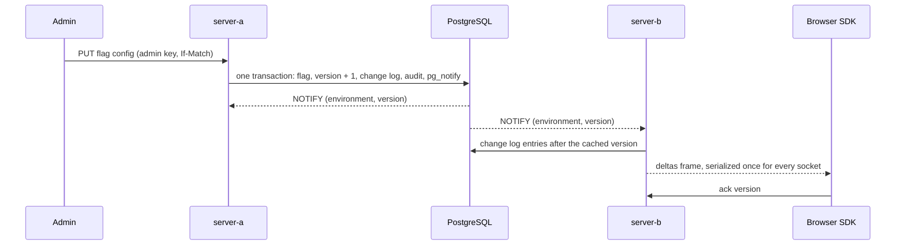

# flagtide

A self-hosted feature flag service. A Quarkus back end pushes flag changes to every open browser over WebSockets, and an Angular SDK evaluates the flags locally with results that match the server's.



Live demo: not deployed yet. <!-- ADRIAN: paste the URL of the deployed demo here -->

[](https://github.com/adiyy2001/flagtide/actions/workflows/ci.yml)

[](LICENSE)

The GIF is `scripts/record-demo.mjs` driving the harness page from the end-to-end suite: the admin and the shop in two iframes, both served from the production images. The shop talks to one server instance and the admin to the other, so every change in the recording crosses PostgreSQL. The npm packages `@flagtide/core` and `@flagtide/angular` are not published yet, so there is no npm badge.

## Why I built this

Feature flags are part of my daily stack. Two questions kept bothering me. How do you get a flag change to thousands of open browsers in well under a second, and how do you know that Java on the server and TypeScript in the browser give the same answer for the same flag?

I work mostly in Angular and I also build Java and Quarkus back ends, so this project sits on both sides of that line. I wanted one compact project that shows hexagonal architecture and domain-driven design on a real domain with real rules, not a CRUD toy. <!-- ADRIAN: add one or two sentences about a moment at work where a flag rollout or a stale client hurt, if you have one -->

## What is hard about it

1. Two languages, one answer. Rollouts hash the context key, and any difference in signed arithmetic, UTF-8 handling or semver ordering sends a user to a different variant on the server than in the browser. The algorithm is a written spec, both engines are my own code, and 616 shared vectors run in both languages in CI. The expected hashes come from an independent Python oracle, so a bug that both engines share cannot pass ([ADR 0009](docs/adr/0009-evaluation-bucketing-conformance.md)).
2. Several instances without a broker. PostgreSQL `NOTIFY` is ordered but not durable and carries at most 8,000 bytes. The payload is only a pointer, every instance reads the change log after the version it has seen, and each listener reconnect triggers a resync. A test kills the listener's backend and checks that the next change still arrives ([ADR 0008](docs/adr/0008-change-log-versions-and-notify.md)).
3. 5,000 sockets and a slow one among them. A change is serialized once per instance and the same string goes to every socket. A connection with 256 frames waiting gets closed, so one stuck client cannot hold up the rest ([ADR 0017](docs/adr/0017-stream-fan-out-and-load-test.md)).
4. Telling the user whether the flags are current. A browser cannot see WebSocket pings, so the server sends its own heartbeat and the SDK watches timestamps instead of counting timer ticks, because background tabs throttle timers. The status is one of `connecting`, `live`, `stale` or `offline` ([ADR 0010](docs/adr/0010-wire-protocol-and-auth.md)).
5. Ports that have tests. The in-memory and the PostgreSQL adapter run the same eight contract tests, and the ArchUnit rules are shown to fail on a planted violation, so they cannot pass vacuously ([ADR 0005](docs/adr/0005-hexagonal-modules.md), [ADR 0014](docs/adr/0014-layer-coverage-gates-across-modules.md)).

## How it works



The back end is split into Maven modules that follow the dependency rule: `domain` is plain Java, `application` holds the use cases and ports, the adapters (REST, WebSocket, PostgreSQL, in-memory) depend on `application` and never on each other, and only `bootstrap` knows them all. ArchUnit checks that from the outside ([ADR 0005](docs/adr/0005-hexagonal-modules.md)).

One change travels like this:



A client connects with an SDK key and its last known version. If the version is inside the retained window it receives exactly the entries it missed, and otherwise a full snapshot. The wire format is in [docs/protocol.md](docs/protocol.md).

The maths that has to be the same in both languages. A context key is hashed into one of 100,000 buckets, so one bucket is 0.001 percent:

$$b = \operatorname{murmur3}_{x86,32}\big(\operatorname{utf8}(k \mathbin\Vert \texttt{.} \mathbin\Vert s \mathbin\Vert \texttt{.} \mathbin\Vert c)\big) \bmod 100000$$

Here $k$ is the flag key, $s$ the flag's salt and $c$ the context key, and the hash is read as an unsigned 32-bit integer. A rollout lists variants with integer weights $w_1, \dots, w_n$ that sum to exactly 100000, and the context gets the first variant $i$ whose running total passes the bucket:

$$\sum_{j \le i} w_j > b$$

Because a boolean rollout lists `true` first, raising its weight from $p_1$ to $p_2$ only moves the threshold up, so a context that was in at $p_1$ is still in at $p_2$. A property test checks that. After a lost connection the client waits a random time with full jitter, in milliseconds:

$$d_n \sim \mathrm{Uniform}\big(0,\ \min(30000,\ 500 \cdot 2^{n})\big)$$

The full algorithm, including operators, semver pre-release rules and segments, is [docs/evaluation-spec.md](docs/evaluation-spec.md).

## Validation and benchmarks

Every number below is printed by `pnpm report` from the JSON files in `bench/results`, which the scripts in this repository wrote on one machine. Each file carries the hardware it ran on.

```
CPU: 12th Gen Intel(R) Core(TM) i7-12700H, 20 logical cores, 15.5 GiB RAM
OS: linux 6.6.87.2-microsoft-standard-WSL2, Docker 29.1.3
Node v24.21.0 (V8 13.6.233.17-node.53), Chromium 153.0.8010.12 headless
```

It is a laptop under WSL2 that other jobs share, and the clients, the servers and PostgreSQL all run on it. These are numbers for this machine.

### Propagation from commit to client

The target is a p95 under 300 ms with 5,000 clients. `pnpm bench:load` starts PostgreSQL and both instances, then k6 (from its official Docker image) opens 5,000 WebSockets split over the two instances, using 50 virtual users with 100 sockets each. One more user changes a flag through the REST API of alternating instances once a second, 30 times. Each delta frame is timed as receipt time minus the commit time carried in the frame.

| Clients | Instances | Changes | Frames received | p50 | p95 | p99 | max |
| --- | --- | --- | --- | --- | --- | --- | --- |
| 5,000 | 2 | 30 | 150,000 | 38 ms | 77 ms | 90 ms | 127 ms |

No socket failed to connect or closed early. The instances time the acknowledgements their clients send back, which is what the admin's propagation monitor shows: p50 42 ms, p95 87 ms and p99 108 ms over the same 150,000 samples. Every process runs on one host, so there is one clock and no skew. The target is met. Six runs on this machine gave a p95 between 77 and 169 ms, so expect a spread on a shared host. How the time is defined is in [ADR 0011](docs/adr/0011-propagation-measurement.md).

### SDK evaluation per flag

The target is under 5 µs. `pnpm nx run core:bench` measures `@flagtide/core` with tinybench in Node and in headless Chromium.

| Runtime | Scenario | Mean | p99 | Evaluations per second |
| --- | --- | --- | --- | --- |
| Node | kill switch | 0.047 µs | 0.075 µs | 23,816,369 |
| Node | percentage rollout | 0.412 µs | 0.551 µs | 2,821,445 |
| Node | targeted rules with segment and rollout | 0.333 µs | 0.9 µs | 4,664,118 |
| Chromium | kill switch | 0.07 µs | n/a | 14,278,689 |
| Chromium | percentage rollout | 0.315 µs | n/a | 3,169,272 |
| Chromium | targeted rules with segment and rollout | 0.325 µs | n/a | 3,071,456 |

Chromium clamps `performance.now()` on a page that is not cross-origin isolated, so single-call latencies fall below the timer resolution and the p99 column is empty. The means are taken over millions of calls.

### Admin and shop end to end

The Cypress suite measures with a `MutationObserver` in the shop, against the click in the admin. The last run on this machine gave 30 to 80 ms from click to changed DOM, against a budget of one second. The number is logged by every run of `pnpm nx run e2e:e2e`.

### Accessibility

`scripts/lighthouse.sh` runs Lighthouse 13.5.0 on six admin pages and two shop pages against the production images. Every page scores 100 for accessibility and 100 for best practices, with no failed audit, against a floor of 95. Nobody has used the admin with a real screen reader yet.

### Coverage

| Area | Lines | Branches |
| --- | --- | --- |
| `libs/core` | 98.7% | 95.4% |
| `libs/angular` | 98.8% | 94.9% |
| `apps/admin` | 92.9% | 87% |
| `apps/demo-shop` | 95.2% | 98.4% |
| server domain | 99.1% | 96.9% |
| server application | 99.1% | 93.4% |
| server adapters | 95.4% | 74.8% |
| server bootstrap | 96.3% | 69.2% |

The gates are 90% of lines for the evaluation engines, the domain and the application layer, and 80% for everything else. The branch figures for the adapters and the bootstrap module are lower because most of their branches are error paths around PostgreSQL and Quarkus.

## Run it locally

You need Docker with Compose.

```
git clone https://github.com/adiyy2001/flagtide.git
cd flagtide
docker compose up -d --build --wait
```

That builds and starts PostgreSQL, two server instances, the admin, the demo shop and a one-shot job that seeds a demo project. From a fresh clone it took about a minute on this machine with the base images already pulled, and it takes longer on a cold one. Then open the admin at <http://127.0.0.1:14200> and the shop at <http://127.0.0.1:14300>, switch `promo-banner` off in the admin and watch the banner leave the shop. `docker compose down -v` stops everything and removes the database. All ports bind to 127.0.0.1 and can be changed with the variables in [docs/configuration.md](docs/configuration.md).

The shop reads from `server-b` and the admin writes to `server-a`. The demo keys in `compose.yaml` are public on purpose and only work against this local stack.

To work on the code you need Node 24 (see `.nvmrc`), pnpm 12 through Corepack and a JDK 21. The Maven Wrapper is in `apps/server`.

```
corepack enable
pnpm install --frozen-lockfile
pnpm verify
```

## Tests

| Command | What it covers |
| --- | --- |
| `pnpm check:text` | The style rules in code: no comments outside the public API, no dashes |
| `pnpm verify` | The check above, Prettier, lint, type check, unit tests with coverage thresholds and production builds for every web project, the packed-package check, the whole Maven build with its coverage gates, the conformance suite and the license policy |
| `pnpm conformance` | The 616 shared vectors (419 evaluation cases) in Java and TypeScript, failing on any mismatch |
| `pnpm nx run server:verify` | Domain tests with jqwik properties, application tests, the contract tests on both adapters, REST and stream flows on memory and on PostgreSQL, ArchUnit, two instances in separate processes against one database |
| `pnpm nx run core:integration` | The SDK against the running compose stack: a change over REST reaches the client, a reconnect receives exactly the missed deltas, a stopped client resumes from its stored version |
| `pnpm nx run e2e:e2e` | 15 Cypress tests against the compose stack: admin editing and 409 conflicts, a toggle in the admin reaching the shop on the other instance, rollouts, an offline start with both servers stopped, server rendering |
| `scripts/verify-must-haves.sh` | Brings up the production stack and prints PASS or FAIL for 17 checks, one for each must-have behaviour |
| `scripts/lighthouse.sh` | Lighthouse on the production images |
| `pnpm bench:load` | The 5,000 client propagation test |
| `pnpm test:counts` and `pnpm report` | Run every test target and print the counts, and print the benchmark and coverage tables above |

The test counts from the last run: 1,327 in the server modules (including the 617 conformance cases in the domain module), 426 in the spec project (every vector is well formed, and the committed files are exactly what the Python oracle and generator produce), 199 in `libs/core`, 39 in `libs/angular` (3 of them render on the server in a Node environment that traps every browser global), 200 in the admin and 64 in the demo shop. The domain has jqwik properties for uniform bucketing (a chi-square test over a million keys), determinism and monotonic rollouts, and the TypeScript side has fast-check versions. The SDK is tested against a fake WebSocket server and with marble tests for reconnect, backoff and the stale watchdog.

CI is `.github/workflows/ci.yml`: static checks, conformance in both languages (it blocks the other jobs), web, server, licenses, end to end with Lighthouse and the must-have script, and a short load test. It has not run on GitHub yet and `act` is not installed here, so I linted it with actionlint and ran the commands of each job locally.

## Design decisions

The decisions that shape the project:

- Nx with pnpm, and Maven wrapped in run-commands targets because the Quarkus plugin for Nx has had no release since March 2025 ([0001](docs/adr/0001-nx-pnpm-monorepo.md), [0002](docs/adr/0002-maven-inside-nx.md)).
- Vitest instead of Jest, because Angular 22 no longer documents Jest ([0004](docs/adr/0004-vitest-over-jest.md)).
- Hexagonal modules checked by Maven and ArchUnit ([0005](docs/adr/0005-hexagonal-modules.md)).
- One `Flag` aggregate for the definition and every environment, optimistic concurrency by revision ([0006](docs/adr/0006-aggregates-concurrency-and-keys.md)).
- JDBI, Flyway and JSONB documents instead of an ORM ([0007](docs/adr/0007-persistence-jdbi-flyway-jsonb.md)).
- A per-environment change log, versions that only grow, and `LISTEN/NOTIFY` with pointer payloads ([0008](docs/adr/0008-change-log-versions-and-notify.md)).
- The evaluation algorithm, my own MurmurHash3 and the conformance suite ([0009](docs/adr/0009-evaluation-bucketing-conformance.md)).
- The wire protocol, the key in the first frame and the four connection states ([0010](docs/adr/0010-wire-protocol-and-auth.md)).
- How propagation time is measured ([0011](docs/adr/0011-propagation-measurement.md)) and how the load test is built ([0017](docs/adr/0017-stream-fan-out-and-load-test.md)).
- An SDK split into a framework-agnostic core and an Angular package, zoneless and safe under SSR ([0012](docs/adr/0012-sdk-packaging-zoneless-ssr.md)).
- The license policy and the few documented exceptions ([0013](docs/adr/0013-dependency-license-policy.md)).
- The admin's editor state model ([0018](docs/adr/0018-admin-editor-state-model.md)) and the end-to-end harness ([0019](docs/adr/0019-e2e-harness.md)).
- The project name, what I did not build and where the numbers come from ([0020](docs/adr/0020-project-name.md), [0021](docs/adr/0021-what-is-not-built.md), [0022](docs/adr/0022-numbers-and-demo-recording.md)).

All 22 records are in [`docs/adr`](docs/adr).

## Limitations and what I would do next

- Nothing is deployed and nothing is published, and the `@flagtide` npm scope is not registered yet. `npm pack` works for both packages and is part of `pnpm verify`.
- The stretch goals are not built: flag prerequisites, scheduled changes, an Oracle adapter and an SSE fallback ([ADR 0021](docs/adr/0021-what-is-not-built.md)).
- The admin keys reach the browser in a runtime `config.json`. That is fine for a local demo and wrong for a real deployment, which would need a login in front of the admin.
- The propagation numbers come from one host with one clock. They say nothing about a network between a data center and a phone.
- Each instance fans out from one thread, and the change log keeps a count of entries (1,000 per environment by default), not a time window.
- The end-to-end suite and every browser number come from Chrome. Firefox and Safari are untested, and so are screen readers.
- Next I would build the Oracle adapter, because the contract tests already say what it has to do. After that come prerequisites with a cycle check (a spec change, so new vectors in both languages), then scheduled changes with a single runner across instances.

## Credits and license

flagtide builds on Quarkus, Angular and PostgreSQL, among others. Every dependency and tool is listed with its license in [CREDITS.md](CREDITS.md). flagtide is released under the [MIT license](LICENSE), copyright Adrian Turbiński.
